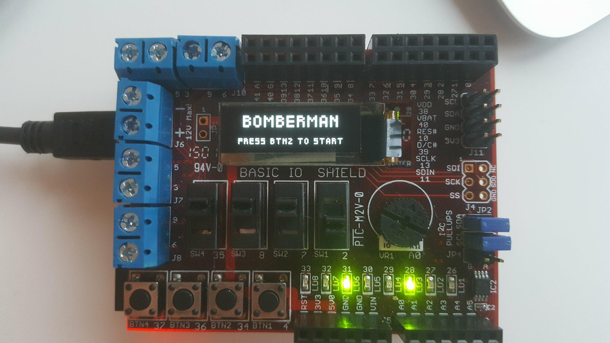
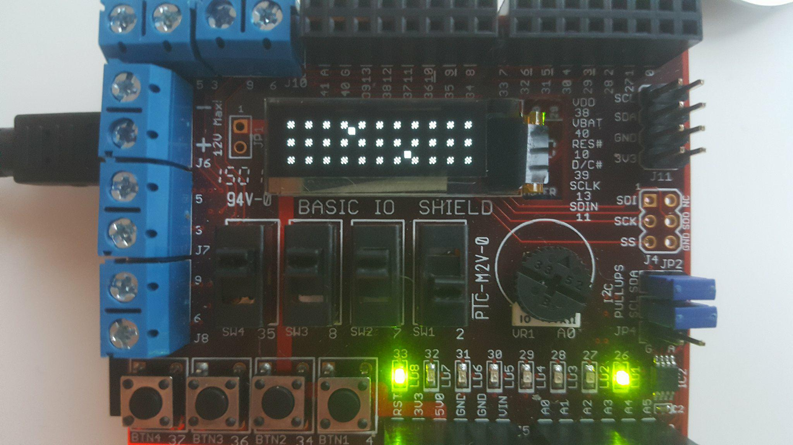
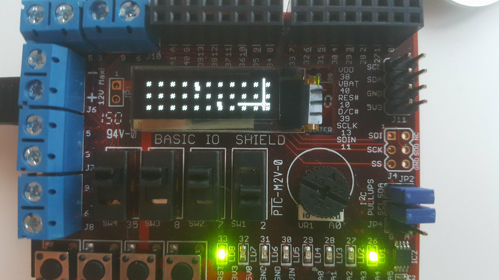

Axel Lindeberg and Mattias Larsson's solutions to the assignments in DTEK17 (IS1500).

This project was moved from another repo.

## Project
Our project was a 2-player bomberman game on a chipkit32 microprocessor.

